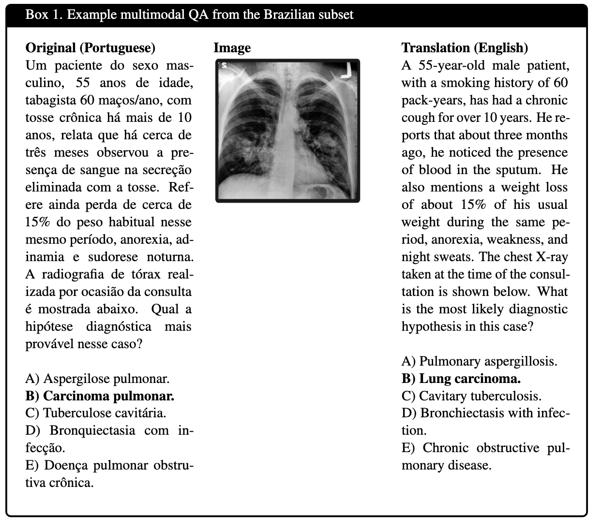
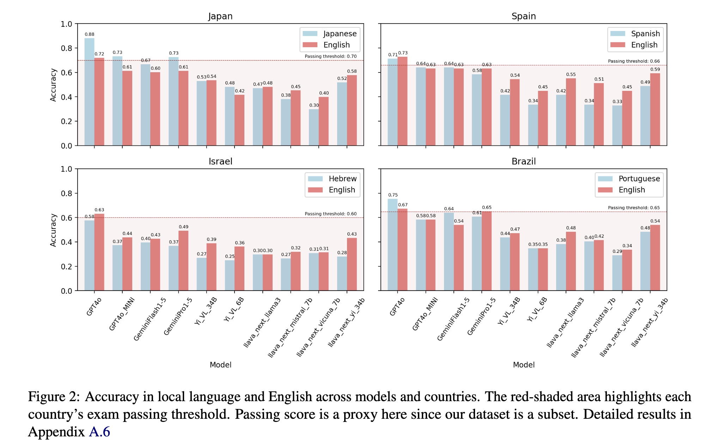

# WorldMedQA-V: A Multilingual, Multimodal Medical Examination Dataset
  
## Overview

**WorldMedQA-V** is a multilingual and multimodal benchmarking dataset designed to evaluate vision-language models (VLMs) in healthcare contexts. The dataset includes medical examination questions from four countries—Brazil, Israel, Japan, and Spain—in both their original languages and English translations. Each multiple-choice question is paired with a corresponding medical image, enabling the evaluation of VLMs on multimodal data.

**Key Features:**
- **Multilingual:** Supports local languages (Portuguese, Hebrew, Japanese, and Spanish) as well as English translations.
- **Multimodal:** Each question is accompanied by a medical image, allowing for a comprehensive assessment of VLMs' performance on both textual and visual inputs.
- **Clinically Validated:** All questions and answers have been reviewed and validated by native-speaking clinicians from the respective countries.

## Dataset Details

- **Number of Questions:** 568
- **Countries Covered:** Brazil, Israel, Japan, Spain
- **Languages:** Portuguese, Hebrew, Japanese, Spanish, and English
- **Types of Data:** Multiple-choice questions with medical images
- **Evaluation:** Performance of models in both local languages and English, with and without medical images

The dataset aims to bridge the gap between real-world healthcare settings and AI evaluations, fostering more equitable, effective, and representative applications.

## Data Structure

The dataset is provided in TSV format, with the following structure:
- **ID**: Unique identifier for each question.
- **Question**: The medical multiple-choice question in the local language.
- **Options**: List of possible answers (A-D).
- **Correct Answer**: The correct answer's label.
- **Image Path**: Path to the corresponding medical image (if applicable).
- **Language**: The language of the question (original or English translation).

### Example from Brazil:

- **Question**: Um paciente do sexo masculino, 55 anos de idade, tabagista 60 maços/ano... [Full medical question see below]
- **Options**:
  - A: Aspergilose pulmonar
  - B: Carcinoma pulmonar
  - C: Tuberculose cavitária
  - D: Bronquiectasia com infecção
- **Correct Answer**: B
  

### Evaluate models/results:

  

## Download and Usage

The dataset can be downloaded from [Hugging Face datasets page](https://huggingface.co/datasets/WorldMedQA/V). All code for handling and evaluating the dataset is available in the following repositories:
- **Dataset Code**: [WorldMedQA GitHub repository](https://github.com/WorldMedQA/V)
- **Evaluation Code**: [VLMEvalKit GitHub repository](https://github.com/WorldMedQA/VLMEvalKit/tree/main)

## Citation

Please cite this dataset as follows:

```bibtex
@article{WorldMedQA-V2024,
  title={WorldMedQA-V: A Multilingual, Multimodal Medical Examination Dataset},
  author={Matos and Chen et al.},
  journal={Preprint},
  year={2024},
}